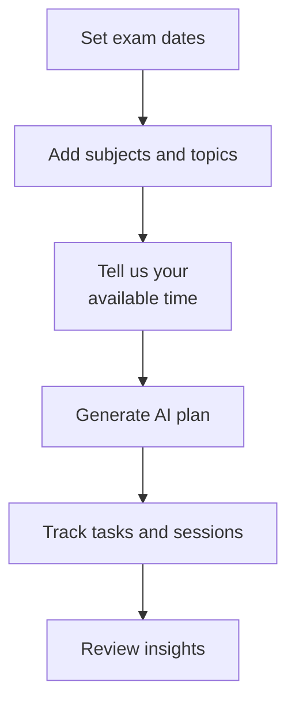

# AI Smart Study Planner for Students

> **Personalized AI-powered study plans that adapt to your pace, priorities, and exam deadlines.**
>
> Transform scattered notes into a focused, actionable daily study schedule. Built for students who want smarter study sessions, not longer ones.


---

## Table of Contents

- [Overview](#overview)
- [Quick Peek](#quick-peek)
- [Feature Highlights](#feature-highlights)
- [Quick Start](#quick-start)
- [How It Works](#how-it-works)
- [API Reference](#api-reference)
- [Tech Stack](#tech-stack)
- [Roadmap](#roadmap)
- [Contributing](#contributing)
- [License](#license)

---

## Overview

AI Smart Study Planner helps students build optimized daily schedules based on exam dates, subject priorities, and available time. It works with or without an OpenAI key, using a fallback algorithm when AI is not configured.

**Perfect for:**

- Students preparing for exams
- Anyone juggling multiple subjects with tight deadlines
- People who need structure but hate rigid schedules

---

## Quick Peek

**Exam-Focused Planning** — Generates optimized schedules considering exam dates & priorities

**Real-Time Tracking** — Track progress, mark tasks done, log study sessions

**Actionable Insights** — View trends, identify weak spots, boost motivation

---

## Feature Highlights

| Feature | Benefit |
|---------|---------|
| **AI-Powered Plans** | Dynamic schedules that shift with your pace |
| **Exam-Date Tracking** | Never miss a deadline |
| **Progress Insights** | Identify gaps and weak spots fast |
| **Fallback Heuristic** | Works offline or without API keys |
| **Simple UI/UX** | Designed for students, not admins |

---

## How It Works



**The Flow:**

1. **Add Subjects & Exam Dates** – Set priorities and deadlines
2. **Define Daily Study Time** – How much time can you dedicate?
3. **AI Generates Your Plan** – Balanced, deadline-aware schedule
4. **Study & Log Progress** – Mark tasks done as you go
5. **Adjust & Repeat** – Insights guide your next week

---

## Quick Start

### Prerequisites

- PHP 8.2 or higher
- Composer
- Node.js 20+ and npm
- OpenAI API key (optional)

### Installation

1. Install dependencies:

```powershell
composer install
npm install
```

2. Configure environment:

```powershell
copy .env.example .env
```

Then update `.env` with your database settings and optional OpenAI key.

3. Set up the database:

```powershell
php artisan migrate
```

4. Build frontend assets:

```powershell
npm run build
```

Or for development with hot reload:

```powershell
npm run dev
```

5. Start the app:

```powershell
php artisan serve
```

Visit <http://localhost:8000>

---

## API Reference

### Authentication

- `POST /register`
- `POST /login`
- `POST /logout`

### Subjects

- `GET /api/subjects`
- `POST /api/subjects`
- `PUT /api/subjects/{id}`
- `DELETE /api/subjects/{id}`

### Topics

- `GET /api/subjects/{id}/topics`
- `POST /api/subjects/{id}/topics`
- `PUT /api/topics/{id}`
- `DELETE /api/topics/{id}`

### Study Plans

- `GET /api/plans/today`
- `POST /api/plans/generate`
- `POST /api/plans/regenerate`

### Tasks

- `PATCH /api/tasks/{id}`

### Progress Logs

- `POST /api/progress-logs`

---

## Tech Stack

- **Backend:** Laravel 11 (PHP 8.2)
- **Frontend:** React + TypeScript + Inertia.js
- **Database:** SQLite (dev) / MySQL (prod)
- **AI:** OpenAI (with fallback heuristic)
- **Styling:** Tailwind CSS
- **Auth:** Laravel Breeze

---

## Roadmap

- [ ] Add onboarding walkthrough with guided setup
- [ ] Add downloadable calendar export (ICS)
- [ ] Add study streak tracking and reminders
- [ ] Expand analytics charts with weekly trends
- [ ] Mobile app
- [ ] Study group collaboration

---

## Contributing

Pull requests are welcome. Please open an issue for major changes.

## License

MIT
