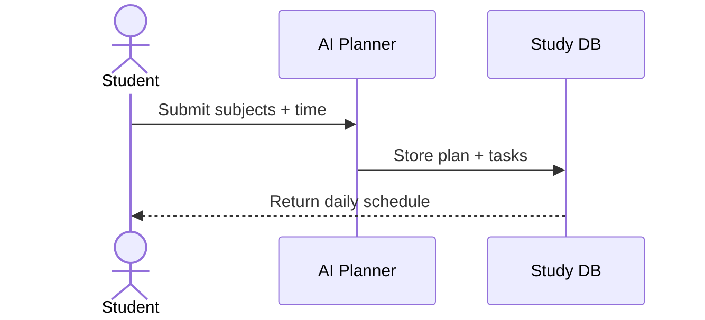
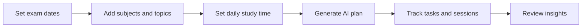
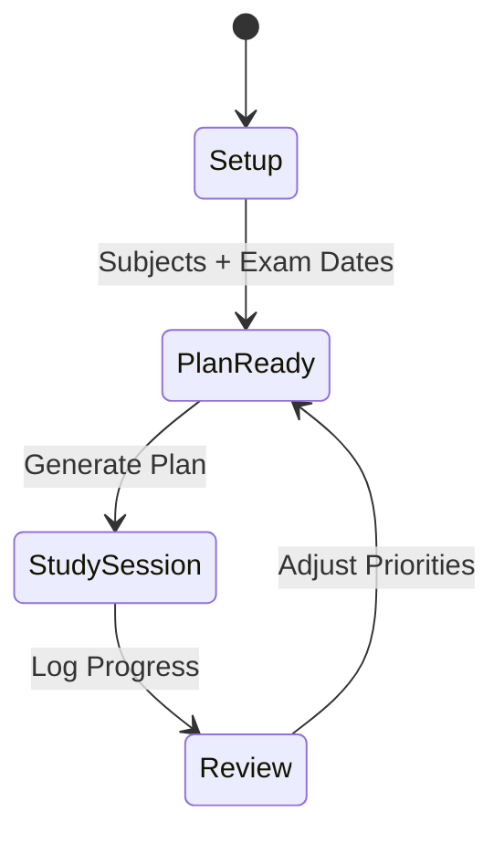
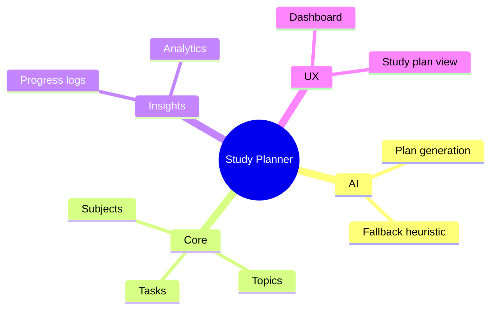
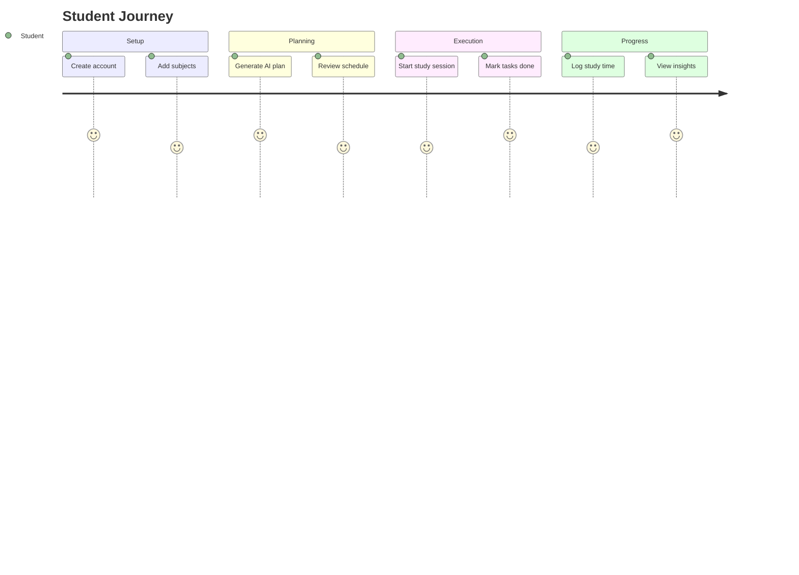
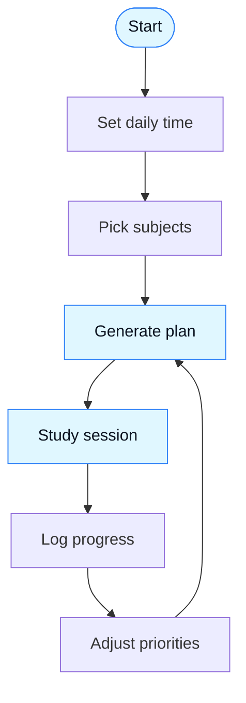
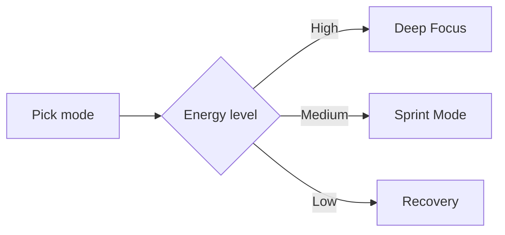
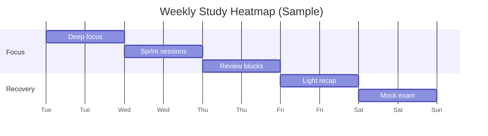

<div align="center">
  
</div>

<div align="center">
  
</div>

<div align="center">
  
  
  
</div>

<div align="center">
  
  
  
  
  
  
</div>

<div align="center">
  
</div>

---

## Table of Contents

- [Overview](#overview)
- [Quick Peek](#quick-peek)
- [Demo Gallery](#demo-gallery)
- [Motion Highlights](#motion-highlights)
- [Feature Highlights](#feature-highlights)
- [Quick Start](#quick-start)
- [API Endpoints](#api-endpoints)
- [Project Structure](#project-structure)
- [System Map](#system-map)
- [Experience Journey](#experience-journey)
- [Milestone Radar](#milestone-radar)
- [Repo Pulse](#repo-pulse)
- [Plan Loop](#plan-loop)
- [Study Matrix](#study-matrix)
- [Focus Modes](#focus-modes)
- [Schedule Heatmap](#schedule-heatmap)
- [Before vs After](#before-vs-after)
- [Roadmap](#roadmap)
- [Contributing](#contributing)
- [License](#license)

---

## Overview

AI Smart Study Planner helps students build optimized daily schedules based on exam dates, subject priorities, and available time. It works with or without an OpenAI key, using a fallback algorithm when AI is not configured.

<div align="center">
  
</div>

---

## Live Metrics

<div align="center">
  
  
</div>

<div align="center">
  
  
  
</div>

<div align="center">
  
</div>

---

## Quick Peek

<table>
  <tr>
    <td align="center" width="33%">
      <strong>AI Plan Engine</strong><br />
      🧠 Smart daily schedules<br />
      ⏱️ Time-aware balancing<br />
      🎯 Priority-first focus
    </td>
    <td align="center" width="33%">
      <strong>Subject Board</strong><br />
      📚 Topics and milestones<br />
      🗓️ Exam date tracking<br />
      🧩 Chunked tasks
    </td>
    <td align="center" width="33%">
      <strong>Progress Pulse</strong><br />
      ✅ Task completion flow<br />
      📈 Momentum insights<br />
      🔁 Daily streaks
    </td>
  </tr>
</table>



---

## Demo Gallery



---

## Motion Highlights

```mermaid
gantt
  title Example Daily Study Flow
  dateFormat  HH:mm
  section Morning
  Math practice            :a1, 09:00, 01:00
  section Afternoon
  Chemistry recap          :a2, 14:00, 00:45
  section Evening
  History essay outline    :a3, 20:00, 00:50
```



| Interaction | Visual effect | Purpose |
| --- | --- | --- |
| Generate plan | Loading pulse + success glow | Makes AI actions feel responsive |
| Mark task done | Check animation + progress bump | Reinforces momentum |
| Dashboard cards | Subtle hover lift | Highlights key stats |

---

## Feature Highlights

| Area | What it does | Why it matters |
| --- | --- | --- |
| AI Planning | Generates daily plans and task sequences | Keeps study time aligned with deadlines |
| Subject + Topic Tracking | Breaks down subjects into actionable items | Creates manageable goals |
| Progress Tracking | Marks tasks and logs study sessions | Keeps motivation visible |
| Analytics | Shows trends, velocity, and completion ratios | Identifies weak spots early |
| Fallback Planning | Works without OpenAI credentials | No hard dependency on AI |



---

## Quick Start

### Prerequisites

- PHP 8.2 or higher
- Composer
- Node.js 20+ and npm
- OpenAI API key (optional)

### Installation

1. Install dependencies:
   ```powershell
   composer install
   npm install
   ```

2. Configure environment:
   ```powershell
   copy .env.example .env
   ```
   Then update `.env` with your database settings and optional OpenAI key.

3. Set up the database:
   ```powershell
   php artisan migrate
   ```

4. Build frontend assets:
   ```powershell
   npm run build
   ```
   Or for development with hot reload:
   ```powershell
   npm run dev
   ```

5. Start the app:
   ```powershell
   php artisan serve
   ```

Visit http://localhost:8000

<div align="center">
  
</div>

---

## API Endpoints

### Authentication

- `POST /register`
- `POST /login`
- `POST /logout`

### Subjects

- `GET /api/subjects`
- `POST /api/subjects`
- `PUT /api/subjects/{id}`
- `DELETE /api/subjects/{id}`

### Topics

- `GET /api/subjects/{id}/topics`
- `POST /api/subjects/{id}/topics`
- `PUT /api/topics/{id}`
- `DELETE /api/topics/{id}`

### Study Plans

- `GET /api/plans/today`
- `POST /api/plans/generate`
- `POST /api/plans/regenerate`

### Tasks

- `PATCH /api/tasks/{id}`

### Progress Logs

- `POST /api/progress-logs`

---

## Project Structure

```
app/
├── Http/
│   ├── Controllers/
│   └── Requests/
├── Models/
└── Services/
    └── StudyPlanGenerator.php

database/
└── migrations/

resources/
├── js/
│   ├── Pages/
│   └── Layouts/
└── css/

routes/
├── api.php
└── web.php
```

---

## System Map



---

## Experience Journey



---

## Milestone Radar

```mermaid
radar
  title Study Readiness Snapshot
  indicators
    Consistency: 78
    Coverage: 64
    Confidence: 55
    Urgency: 70
    Focus: 82
```

---

## Repo Pulse

<div align="center">
  
  
  
  
</div>

<div align="center">
  
</div>

---

## Plan Loop



---

## Study Matrix

<table>
  <tr>
    <td align="center" width="25%">📚 Subjects</td>
    <td align="center" width="25%">🧠 Focus</td>
    <td align="center" width="25%">⏱️ Time</td>
    <td align="center" width="25%">✅ Progress</td>
  </tr>
  <tr>
    <td align="center">Math, Chemistry</td>
    <td align="center">High priority</td>
    <td align="center">120 min/day</td>
    <td align="center">68% complete</td>
  </tr>
  <tr>
    <td align="center">History, English</td>
    <td align="center">Medium priority</td>
    <td align="center">90 min/day</td>
    <td align="center">52% complete</td>
  </tr>
  <tr>
    <td align="center">CS, Biology</td>
    <td align="center">Upcoming exam</td>
    <td align="center">150 min/day</td>
    <td align="center">74% complete</td>
  </tr>
</table>

<div align="center">
  
  
  
</div>

---

## Focus Modes

<table>
  <tr>
    <td align="center" width="33%">🎯 Deep Focus<br />Long blocks, fewer switches</td>
    <td align="center" width="33%">⚡ Sprint Mode<br />Short bursts, high intensity</td>
    <td align="center" width="33%">🧘 Recovery Mode<br />Light review, reduce fatigue</td>
  </tr>
</table>



---

## Schedule Heatmap



---

## Before vs After

<table>
  <tr>
    <th align="center">Before</th>
    <th align="center">After</th>
  </tr>
  <tr>
    <td align="center">Scattered tasks</td>
    <td align="center">Aligned daily plan</td>
  </tr>
  <tr>
    <td align="center">No clear priorities</td>
    <td align="center">Priority-driven focus</td>
  </tr>
  <tr>
    <td align="center">Inconsistent progress</td>
    <td align="center">Visible momentum</td>
  </tr>
  <tr>
    <td align="center">Stress spikes</td>
    <td align="center">Balanced workload</td>
  </tr>
</table>

---

## Roadmap

- [ ] Add onboarding walkthrough with guided setup
- [ ] Add downloadable calendar export (ICS)
- [ ] Add study streak tracking and reminders
- [ ] Expand analytics charts with weekly trends

---

## Contributing

Pull requests are welcome. Please open an issue for major changes.

## License

MIT

<div align="center">
  
</div>
