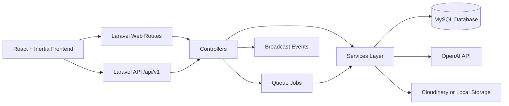
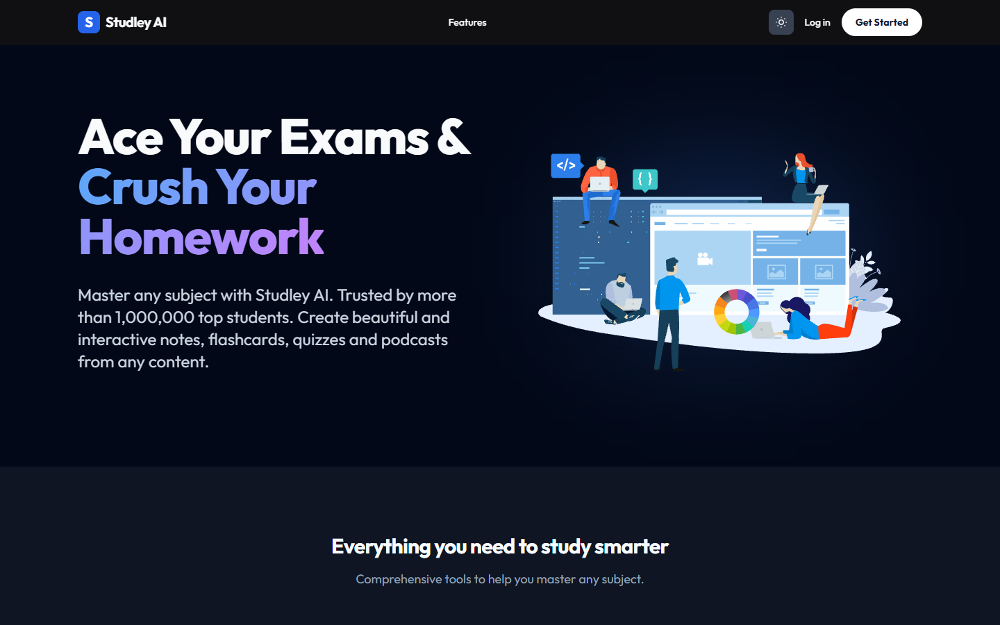
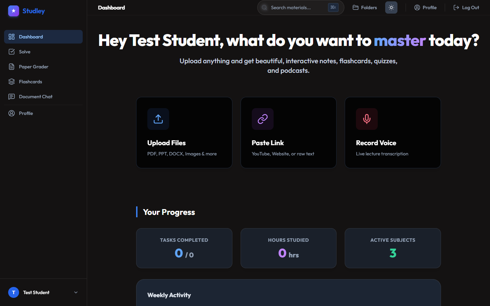
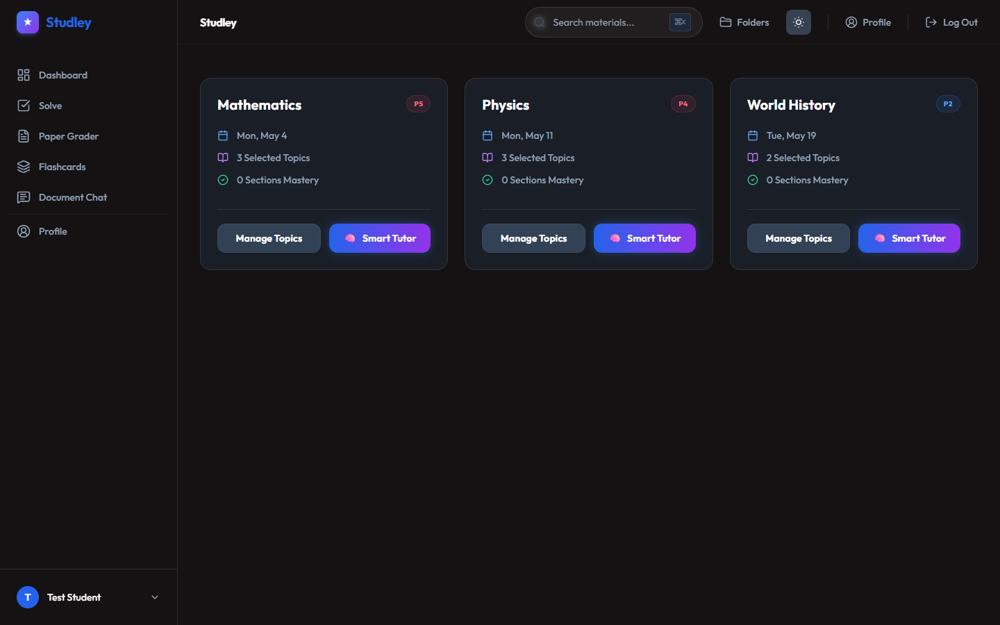
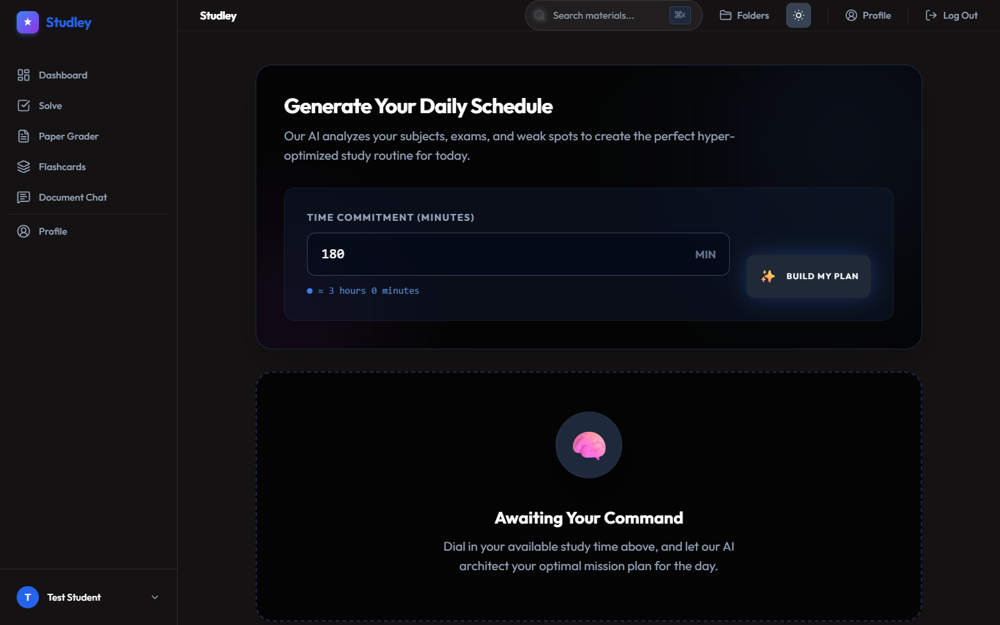
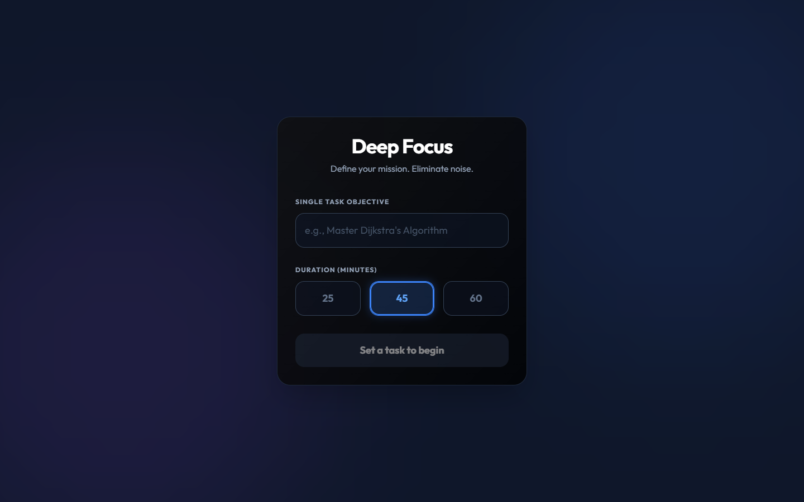
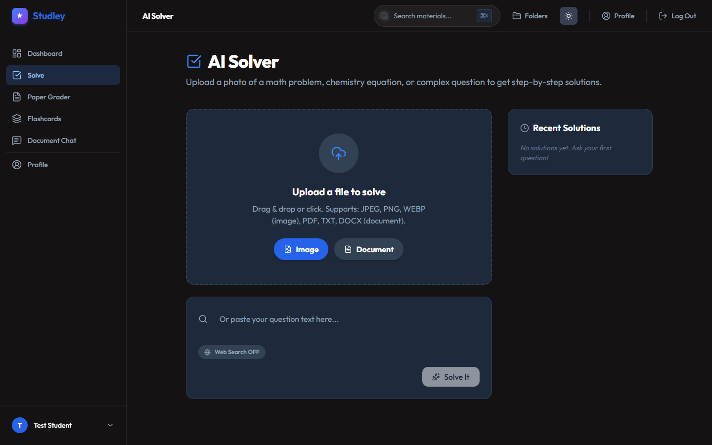
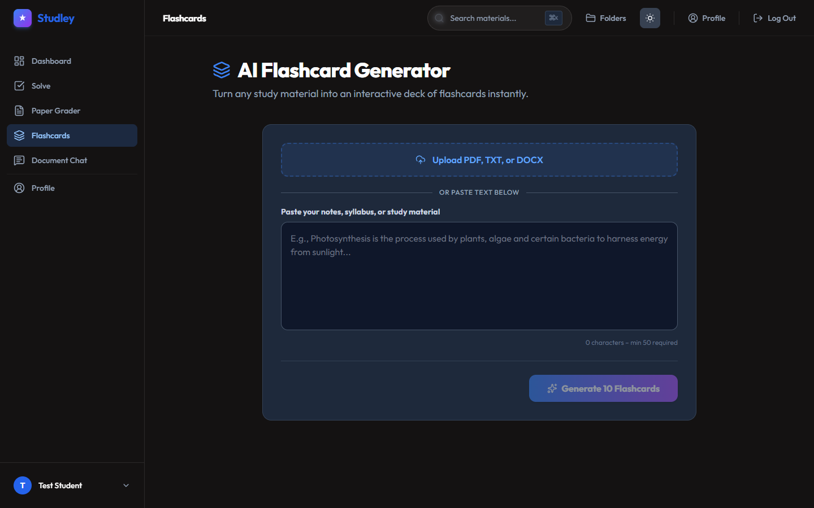

# AI Smart Study Planner for Students

Comprehensive project documentation for academic review.

This README is intentionally detailed so a reviewer can understand the system without opening source files.

## Table of Contents

1. [Project Summary](#project-summary)
2. [Core Objectives](#core-objectives)
3. [System Architecture](#system-architecture)
4. [Technology Stack](#technology-stack)
5. [Screenshots](#screenshots)
6. [User Workflows](#user-workflows)
7. [Feature-by-Feature Functional Explanation](#feature-by-feature-functional-explanation)
8. [API Reference (Implemented Routes)](#api-reference-implemented-routes)
9. [Data Model and Database Design](#data-model-and-database-design)
10. [Authentication, Authorization, and Security](#authentication-authorization-and-security)
11. [AI Behavior and Fallback Logic](#ai-behavior-and-fallback-logic)
12. [Background Jobs and Queue Processing](#background-jobs-and-queue-processing)
13. [Real-Time and Notifications](#real-time-and-notifications)
14. [Environment Configuration](#environment-configuration)
15. [Local Setup and Run Guide (Windows)](#local-setup-and-run-guide-windows)
16. [Docker Setup](#docker-setup)
17. [Testing and Quality](#testing-and-quality)
18. [Known Constraints and Notes](#known-constraints-and-notes)
19. [Project Structure Map](#project-structure-map)
20. [License](#license)

## Project Summary

AI Smart Study Planner is a Laravel 11 + React/Inertia application that helps students:

- organize subjects and topics,
- generate daily study plans based on deadlines and available minutes,
- upload study materials,
- run AI-powered tutoring tools (solve, grading, flashcards, document chat),
- track task progress and activity,
- export data and receive notifications.

The system supports both:

- API usage (`/api/v1/...`) with JWT/session auth,
- browser-based web UI pages rendered via Inertia.

## Core Objectives

1. Convert exam schedules into practical daily tasks.
2. Reduce manual planning time with AI-assisted planning.
3. Keep study sessions measurable through progress/task logging.
4. Support multiple study input formats: PDF, images, and text.
5. Provide fallback behavior when external AI services are unavailable.

## System Architecture



### Main Architectural Patterns

- Controller + Service split for business logic.
- Form Requests for validation on critical endpoints.
- Policies for model-level authorization.
- Enum casting for safer status/document fields.
- Queue jobs for asynchronous/long-running processing.
- Resource classes for standardized API responses.

## Technology Stack

### Backend

- PHP 8.2
- Laravel 11
- JWT Auth (`php-open-source-saver/jwt-auth`)
- Sanctum middleware for stateful frontend API calls
- OpenAI PHP client + direct HTTP integration
- Stripe PHP SDK
- Cloudinary Laravel SDK
- `smalot/pdfparser` for PDF text extraction

### Frontend

- React 18 + TypeScript
- Inertia.js
- Vite 7
- Tailwind CSS
- React Query, Zustand, Recharts, Framer Motion, and utility libraries

### Data/Infra

- MySQL (default and recommended local DB)
- Redis support (optional)
- Queue: sync by default, database/redis supported

## Screenshots

The project already includes UI screenshots in `public/docs/screenshots`.

### 1. Landing Page



### 2. Dashboard



### 3. Subjects Management



### 4. Study Plan Page



### 5. Focus Mode



### 6. Solve Tool



### 7. Flashcards Tool



### Re-capture screenshots (if UI changes)

```powershell
npm install puppeteer --save-dev
node capture-screenshots.js
```

## User Workflows

### Workflow A: Planning for Exams

1. User registers/logs in.
2. User creates subjects with exam dates and priority levels.
3. User adds topics (difficulty + estimated hours).
4. User requests a plan with available minutes.
5. System generates a dated daily plan and task list.
6. User updates task statuses while studying.

### Workflow B: Study Material to AI Tutor

1. User uploads PDF/image/document.
2. System stores file metadata and creates a `study_material` record.
3. Background job extracts text and marks processing status.
4. User opens material page.
5. User chats with the material context or requests additional AI actions.

### Workflow C: Quick Assistance Tools

1. User opens Solve, Paper Grader, or Flashcards page.
2. User submits text or image input.
3. Service calls OpenAI and returns structured output.
4. UI displays results and suggestions.

## Feature-by-Feature Functional Explanation

### 1) Authentication and Account Lifecycle

- Sign up validates strong passwords (mixed case, number, symbol, min length).
- Login supports optional 2FA code or recovery code.
- Session records are created after successful JWT login.
- Password reset and email verification endpoints are implemented.
- Token refresh and logout endpoints are implemented.

### 2) Subject Management

- Create, list, update, delete subjects.
- Subject fields include: name, description, color, icon, exam date, priority level.
- Subjects are user-scoped and protected by ownership/policies.

### 3) Topic Management

- Topics belong to subjects.
- Supports create/list/update/delete.
- Tracks difficulty, estimated study hours, completion status, notes.
- `user_id` is propagated from subject for efficient querying.

### 4) Daily Plan Generation

- Inputs: available minutes (required), optional target date.
- Service collects subjects + topics and builds a planning payload.
- If OpenAI key exists: model is called for JSON tasks + summary.
- If OpenAI fails or key missing: fallback heuristic generates tasks.
- Existing tasks for the day are replaced on regenerate.
- AI feedback snapshots are stored for traceability.

### 5) Task Status and Progress Tracking

- Daily tasks can be status-updated via API and web patch routes.
- Progress logs can be created to record study minutes and completion state.
- Dashboard computes completion ratio and weekly activity summaries.

### 6) File Upload and Study Materials

- Single and multi-file upload endpoints.
- Size/type checks performed before storage.
- Stores in Cloudinary (if configured) or local storage fallback.
- Creates a linked study material record after upload.
- Dispatches asynchronous processing job for extraction/analysis preparation.

### 7) AI Solve (Text and Image)

- Text solve: step-by-step markdown answer.
- Image solve: image converted to base64 and sent for multimodal analysis.
- Missing API key returns explicit error message.

### 8) Paper Grading

- Accepts text and rubric.
- Requests strict JSON result from model.
- Returns score, letter grade, summary, grammar feedback, argument notes, actionable tips.

### 9) Flashcards Generation

- Accepts source text, card count, difficulty.
- Returns JSON array of term/definition flashcards.

### 10) Document Chat

- Uses extracted document content as constrained context.
- Includes recent chat history (last messages) for continuity.
- Explicitly instructs assistant to answer from context only.

### 11) Notifications

- Create/list/delete notifications.
- Mark single or all notifications as read.
- Get unread count.
- Creation dispatches a broadcast event for real-time UX.

### 12) Analytics

- Tracks frontend/backend events with metadata.
- Supports filtered retrieval for admin users.

### 13) Data Export

- Export files, notifications, analytics as CSV or JSON.
- Returns generated download URL and record counts.

### 14) Payments

- Stripe payment intent endpoint implemented.
- Webhook endpoint accepts event payloads and logs event types.

### 15) System Health

- Health endpoint checks DB connectivity and returns operational metadata.

## API Reference (Implemented Routes)

Base path: `/api/v1`

### Public Authentication Routes

| Method | Endpoint | Purpose |
|---|---|---|
| POST | `/auth/signup` | Register user |
| POST | `/auth/login` | Login + optional 2FA flow |
| POST | `/auth/forgot-password` | Send password reset flow |
| POST | `/auth/reset-password` | Complete password reset |
| POST | `/auth/verify-email/{token}` | Verify email token |
| POST | `/auth/payments/webhook` | Stripe webhook callback |

### Protected Authentication and Session Routes

| Method | Endpoint | Purpose |
|---|---|---|
| POST | `/auth/logout` | Invalidate current token |
| POST | `/auth/refresh` | Refresh JWT token |
| POST | `/auth/password/change` | Change account password |
| POST | `/auth/email/resend` | Resend email verification |
| GET | `/auth/sessions` | List active sessions |
| DELETE | `/auth/sessions/{id}` | Remove one session |
| DELETE | `/auth/sessions` | Remove all sessions |

### Two-Factor Auth Routes

| Method | Endpoint | Purpose |
|---|---|---|
| POST | `/auth/2fa/enable` | Start 2FA setup |
| POST | `/auth/2fa/confirm` | Confirm 2FA code |
| DELETE | `/auth/2fa/disable` | Disable 2FA |
| GET | `/auth/2fa/recovery-codes` | Get recovery codes |
| POST | `/auth/2fa/recovery-codes` | Regenerate recovery codes |

### Core Planning Routes

| Method | Endpoint | Purpose |
|---|---|---|
| GET | `/plans/today` | Get current day plan |
| POST | `/plans/generate` | Create plan for day/date |
| POST | `/plans/regenerate` | Rebuild plan for date |
| PATCH | `/tasks/{task}` | Update task status |
| POST | `/progress-logs` | Create study progress log |

### Subject and Topic Routes

| Method | Endpoint | Purpose |
|---|---|---|
| GET | `/subjects` | List subjects |
| POST | `/subjects` | Create subject |
| PUT | `/subjects/{subject}` | Update subject |
| DELETE | `/subjects/{subject}` | Delete subject |
| GET | `/subjects/{subject}/topics` | List subject topics |
| POST | `/subjects/{subject}/topics` | Create topic |
| PUT | `/topics/{topic}` | Update topic |
| DELETE | `/topics/{topic}` | Delete topic |

### File and Paste Routes

| Method | Endpoint | Purpose |
|---|---|---|
| POST | `/files/upload` | Upload one file |
| POST | `/files/upload-multiple` | Upload many files |
| GET | `/files` | List user files |
| GET | `/files/{id}` | Get file details |
| DELETE | `/files/{id}` | Delete file |
| POST | `/files/audio/transcribe` | Transcribe uploaded audio |
| POST | `/files/paste` | Save URL/content paste |
| POST | `/files/paste/fetch-title` | Fetch title from URL |
| POST | `/files/paste/fetch-content` | Fetch extracted content |

### AI Tools Routes

| Method | Endpoint | Purpose |
|---|---|---|
| POST | `/solve/text` | AI solve from text prompt |
| POST | `/solve/image` | AI solve from image |
| POST | `/paper-grader` | Grade paper/text with rubric |
| POST | `/flashcards/generate` | Generate flashcards |
| POST | `/document-chat` | Chat against document context |

### Notifications, Analytics, Export, and Utility Routes

| Method | Endpoint | Purpose |
|---|---|---|
| GET | `/notifications` | List notifications |
| POST | `/notifications` | Create notification |
| PATCH | `/notifications/{id}/read` | Mark notification read |
| PATCH | `/notifications/mark-all-read` | Mark all read |
| DELETE | `/notifications/{id}` | Delete notification |
| GET | `/notifications/unread-count` | Count unread notifications |
| POST | `/analytics/event` | Track analytics event |
| GET | `/analytics/events` | Read analytics events (admin) |
| GET | `/export/files` | Export files data |
| GET | `/export/notifications` | Export notifications data |
| GET | `/export/analytics` | Export analytics data (admin) |
| POST | `/payments/intent` | Create Stripe payment intent |
| GET | `/health` | Health check |
| GET | `/profile` | Current user profile payload |
| GET | `/admin-only` | Role-protected sample endpoint |

### API Error Format

```json
{
  "success": false,
  "message": "Validation Error",
  "error": {
    "statusCode": 422,
    "details": {
      "field": ["error message"]
    }
  }
}
```

## Data Model and Database Design

### Primary Entities

- `users`
- `subjects`
- `topics`
- `daily_plans`
- `daily_tasks`
- `progress_logs`
- `ai_feedback`
- `files`
- `study_materials`
- `chat_messages`
- `notifications`
- `analytics_events`
- `sessions`
- `transactions`

### Planning Relationships

- One user has many subjects.
- One subject has many topics.
- One daily plan belongs to one user and has many daily tasks.
- One daily task maps to one topic.
- One progress log ties user + topic + date.

### AI Material Relationships

- One uploaded file can be linked to one or more study material records.
- One study material has many chat messages.

## Authentication, Authorization, and Security

### Auth Strategy

- JWT for API authentication.
- Session-auth compatibility for same-origin frontend API requests.
- Custom JWT middleware handles token parsing and error responses.

### Authorization

- Policy-based access checks for user-owned entities.
- Role middleware (`role:admin`) for admin-only endpoints.

### Security Controls

- Validation across controllers and request classes.
- Route throttling on resource-intensive endpoints.
- Security headers middleware applied on web stack.
- Unified JSON exception handling for API paths.

## AI Behavior and Fallback Logic

### Planner Fallback

If `OPENAI_API_KEY` is absent or AI call fails:

- planner switches to deterministic fallback task generation,
- sorts subjects by exam date,
- allocates minutes in bounded chunks,
- still returns usable daily tasks.

### Tool-Level Error Handling

- Solve/Flashcards/Grader return explicit, user-readable error messages.
- Content extraction falls back by file type (PDF parser, image OCR via model, plain text read).

## Background Jobs and Queue Processing

Implemented jobs:

- `ProcessStudyMaterialJob`: marks status, extracts text, updates material.
- `ProcessImageJob`: placeholder for image optimization pipeline.
- `SendWelcomeEmailJob`: async welcome email with retry/backoff.
- `ProcessEmail`: simple queued email simulation.

Queue drivers supported: `sync`, `database`, `redis`, `sqs`, `beanstalkd`.

## Real-Time and Notifications

- Notification creation dispatches `NotificationCreated` event.
- Event broadcasts to private user channel: `App.Models.User.{id}`.
- Reverb/Pusher config exists for real-time delivery.

## Environment Configuration

Create `.env` from `.env.example` and configure at least:

```env
APP_NAME="AI Smart Study Planner"
APP_ENV=local
APP_KEY=
APP_DEBUG=true
APP_URL=http://localhost:8000

DB_CONNECTION=mysql
DB_HOST=127.0.0.1
DB_PORT=3306
DB_DATABASE=study_planner
DB_USERNAME=root
DB_PASSWORD=

QUEUE_CONNECTION=sync

OPENAI_API_KEY=
OPENAI_MODEL=gpt-4o

CLOUDINARY_CLOUD_NAME=
CLOUDINARY_API_KEY=
CLOUDINARY_API_SECRET=
```

Recommended additional secret setup:

```powershell
php artisan key:generate
php artisan jwt:secret
```

## Local Setup and Run Guide (Windows)

### Prerequisites

- PHP 8.2+
- Composer
- Node.js 20+
- MySQL 8+

### Install and Build

```powershell
composer install
npm install
Copy-Item .env.example .env
php artisan key:generate
php artisan jwt:secret
php artisan migrate
npm run build
```

### Development Mode

Option A (manual terminals):

```powershell
php artisan serve
npm run dev
php artisan queue:listen
```

Option B (automation script):

```powershell
powershell -ExecutionPolicy Bypass -File .\start-dev.ps1
```

Then open `http://localhost:8000`.

## Docker Setup

```powershell
docker-compose up --build -d
```

Services defined:

- app (PHP-FPM)
- nginx
- db (MySQL)
- redis

## Testing and Quality

### Run tests

```powershell
php artisan test
```

### Lint/format (Laravel Pint)

```powershell
./vendor/bin/pint
```

## Known Constraints and Notes

1. Stripe configuration keys are used in payment controller; ensure related service config values are set in your environment.
2. Queue defaults to `sync`, but file/material jobs are more useful with a real worker (`database` or `redis`).
3. Some legacy status values exist in routes/requests versus enum naming. Keep frontend/backend status values aligned during future refactors.
4. For consistent local persistence, prefer MySQL configuration from `.env`.

## Project Structure Map

```text
app/
  Http/
    Controllers/      # API and web controllers
    Requests/         # Validation rules
    Resources/        # API response transformers
    Middleware/       # Auth/security middleware
  Services/           # Business and integration logic
  Models/             # Eloquent entities and relations
  Jobs/               # Async/background processing
  Policies/           # Authorization rules

resources/
  js/Pages/           # Inertia React pages
  views/              # Blade templates

routes/
  web.php             # Browser routes
  api.php             # API v1 routes
  auth.php            # Laravel auth scaffolding routes

database/
  migrations/         # Schema evolution
```

## License

MIT
